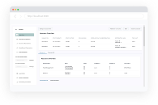

<h2 align="center">:tada: PetriSim [Parametrization of Business Process Simulation] :tada:</h2>




## :rocket: Introduction

Description (Lana): 

........

........

.......


## 📦️ Components
PetriSim consists of multiple components 

(Image of PetriSim and the other components)

......

......

### 📦️ Discovery Tool (Simod)   (Tutku/Alex)

Simod integration into PetriSim is still under work and dockerfile needs to be created.

The Simod repository (https://github.com/AutomatedProcessImprovement/Simod) contains two projects, Simod and Simod HTTP, which is created by University of Tartu, Estonia. Simod HTTP is a lightweight web service wrapper around Simod that supports queued job execution. 

Simod HTTP README.md section is available here, https://github.com/AutomatedProcessImprovement/Simod#simod-http.

Simod HTTP source code is located here, https://github.com/AutomatedProcessImprovement/Simod/tree/master/src/simod_http. 

Docker images are available there, https://hub.docker.com/r/nokal/simod-http/tags or https://hub.docker.com/layers/nokal/simod-http/tu-berlin/images/sha256-2cc67052c748a78c610f619778b119af455d7c5027a983295254f6b7c8d574f6?context=explore

### 📦️ Simulator (Scylla) (Andre/Alex)
describe the API and the API-calls

### 📦️ DockerFile (Scylla) (Tutku)
Following instructers briefly explains the steps required to start the Flask listener in a Scylla Docker container (to run separately from PetriSim):

First, build the Docker image using the Dockerfile. From this directory, in the terminal, call 'sudo docker build -t "WHAT IS FINAL API NAME- UPDATE HERE" .'

This will get Linux, Java, python and all the dependencies and set up the Docker image for later use)

After the Docker image is created, use 'sudo docker run -p 8000:8000 -d "WHAT IS FINAL API NAME- UPDATE HERE"'

This runs the created image and exposes port 8000 for the Flask listener.
You can use 'sudo docker ps' to see it's tag and 'sudo docker logs <container-tag>' to check what it prints. 

! The above instructions assume you compile scylla successfully, using Apache Maven.

### 📦️ PetriSim Frontend (Furat)
- React
- Chakra-Ui
- CI

 
### :heavy_plus_sign: Possible extension of the tool  (Andre,Alex,Tutku,Lana,Furat)
- Explain how to add other tools

## :technologist: Getting started (Furat)

### :star: Run with Docker (recommended) :star:
In order to run out tool with all related components, we recommend to run it by using docker compose.

:exclamation: Prerequisites:
- Docker installed
- Git installed

1. Make sure that docker is started and running (check at the dashboard)

2. Clone the repository
```console
git clone https://github.com/PetriSim/petri-sim-tool.git
```

3. Navigate into the project directory
```console
cd petri-sim-tool 
```

3. Start the docker containers by using docker compose

```console
docker-compose -f docker-compose.yml up -d
```

Docker compose will start the frontend, the discovery tool and the simulator together. Alternatively you can run each docker container seperately.


### Run from source

1. Install node

2. Install npm 

3. Clone git repository

```console
git clone https://github.com/PetriSim/petri-sim-tool.git
```

4. Go to the project directory

```console
cd petri-sim-tool 
```

5. run: 

```console
npm install
```

6. run:
```console
npm start
```

### 🚨 Troubleshooting 

#### Problems related to docker compose (Furat)
* Make sure all ports that are used in the docker compose file are not used by other programs.

#### Problems related to running the program from the source (Furat)
* If your are not able to install the node dependencies with npm install from the root directory, navigate to the backend and frontend directory seperately and do the install (and run) from there 
